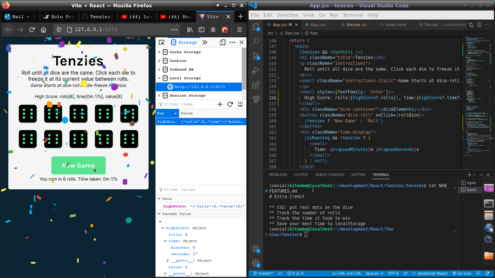

# Tenzies Game

Tenzies is a simple and fun dice game where your objective is to roll the dice and try to get all of them to show the same number. This game also keeps track of your performance, including the number of rolls and the time taken to win.

## Tenzies Screenshot



## How to Play

   1. Starting the Game: The game begins as soon as you click the "Roll" button or when you click on a die to freeze it at its current value.

   2. Rolling the Dice: Click the "Roll" button to roll all the dice that are not held. You can also click on individual dice to freeze them and prevent them from rolling. Your objective is to make all the dice show the same number.

   3. Winning: You win the game when all the dice are held and they all show the same value.

   4. Tracking Your Performance: The game keeps track of the number of rolls and the time taken to win. You can see this information on the screen.

   5. High Score: There is also a high score feature that keeps track of the best performance in terms of the number of rolls, time, and the value achieved.

## High Score

The game also features a high score system, which is stored locally in your browser. Your high score is based on the best performance in terms of the following criteria:

   * Lowest number of rolls.
   * Shortest time to win.
   * The value achieved - dice winning die.

## Installation

1. Clone this repository to your local machine:
    ```
    git clone https://github.com/your-username/tenzies-game.git

    ```
2. Navigate to the project directory:
    ```
    cd tenzies
    ```
3. Install the necessary dependancies:
    ```
    npm i
    ```
4. Start the developent server:
    ```
    npm run dev
    ```
5. Open your web browser and visit http://localhost:5173 to play the game.

## Contributing

We welcome contributions to improve the Tenzies game! To contribute, please follow these steps:

1. Fork the repository on GitHub.
2. Clone your forked repository to your local machine.
3. Create a new branch for your feature or bug fix.
4. Make your changes and commit them.
5. Push your changes to your fork on GitHub.
6. Open a pull request to the original repository.

Your contributions are greatly appreciated!

## Acknowledgments
   
   * Thanks to Scrimba for providing a Figma design - customized for this initial version of the game, and Learn React tutorial which has been helpful in successfull developement of this app.
   * Here's a link to get yourself a platform that will get you there, https://scrimba.com/learn/learnreact
   * Special thanks to Bob Ziroll for the Learn React tutorial available on scrimba and youtube - freecodecamp.
   * Special thanks to me for getting extra credit

## New Features by me

    Check the NEW_FEATURES.md file to see the features that have been added to this game. Feel free to Contribute(or suggest new features) that'll make this game more tenzy ;)